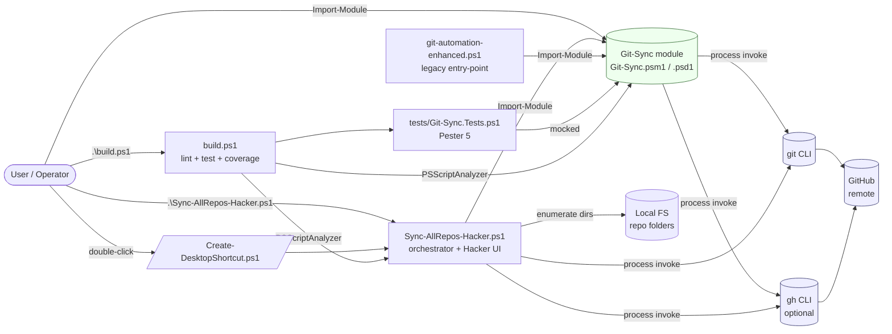
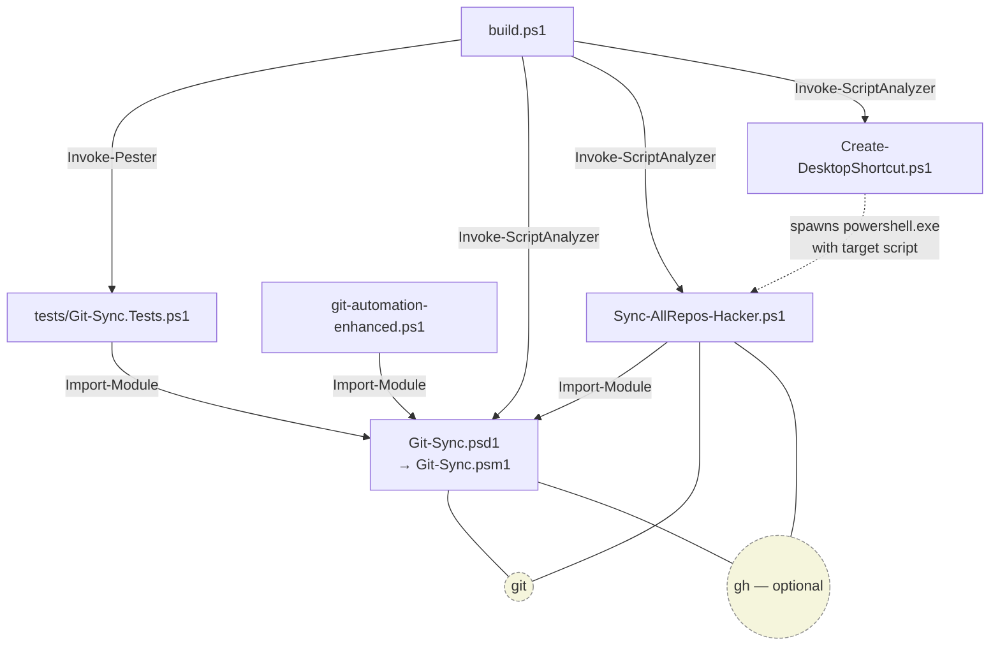
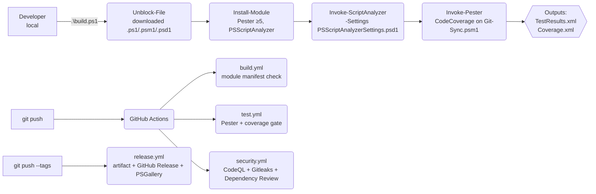
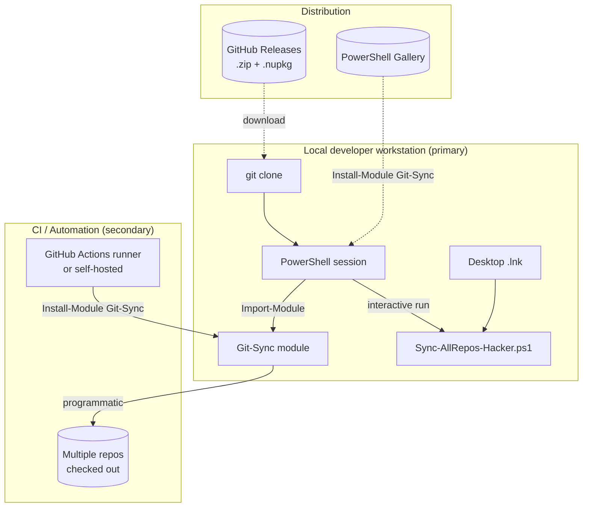

# Architecture

> **Project:** Git-Sync — Multi-account Git automation toolkit
> **Language / Runtime:** PowerShell 5.1+ (cross-tested on PowerShell 7)
> **Target OS:** Windows-first (Windows 10/11). The core module is OS-agnostic; only `Create-DesktopShortcut.ps1` is Windows-only.

This document captures the **runtime architecture, module boundaries, dependency graph, build pipeline, configuration, and deployment topology** of Git-Sync.

---

## 1. High-Level Overview

Git-Sync is a **two-layer** PowerShell project:

| Layer | Purpose | Files |
|---|---|---|
| **Library / Module** (reusable, side-effect-free APIs) | Exposes `Invoke-GitDeploy`, `New-GitRelease`, and helpers via a proper PowerShell module. Safe to consume from any script, CI step, or other module. | `Git-Sync.psm1`, `Git-Sync.psd1` |
| **Application / UI** (orchestration, user-facing) | Discovers repositories across multiple base folders, drives the library functions, and renders a colorful terminal UI with progress bars and summaries. | `Sync-AllRepos-Hacker.ps1`, `Create-DesktopShortcut.ps1`, `git-automation-enhanced.ps1` (legacy wrapper) |

The split exists so that the **module is pure and testable** (Pester mocks the `git` cmdlet directly), while the **UI script** owns interactive concerns, multi-repo iteration, and platform-specific behaviour (Windows shortcuts, ANSI colours, etc.).

---

## 2. Component Diagram

---

## 3. Module Boundaries & Public API

### `Git-Sync` module (`Git-Sync.psm1`)

Exported via `Export-ModuleMember` and declared in `Git-Sync.psd1` `FunctionsToExport`:

| Function | Type | Responsibility |
|---|---|---|
| `Get-NextVersion` | Pure helper | SemVer bump (Patch/Minor/Major + optional `-Prerelease`). |
| `Get-LatestTag` | Helper | Reads `git describe --tags --abbrev=0`, strips `v`/`V` prefix, defaults to `0.0.0`. |
| `Test-GitRepository` | Probe | True iff inside a Git work-tree. |
| `Test-GitRemoteConnectivity` | Probe | True iff `git ls-remote <remote>` succeeds. |
| `Test-GhAuthentication` | Probe | True iff `gh auth status` succeeds. |
| `Invoke-GitCommand` | Wrapper | Centralised `git` invocation with structured `{Success, Output, ExitCode}` result and `-IgnoreError` switch. |
| `Invoke-GitDeploy` | Action | `add -A` → conditional `commit -m` → `push` (with optional `--force-with-lease`). Supports `-WhatIf`. |
| `New-GitRelease` | Action | Calls `Invoke-GitDeploy`, then creates an annotated tag, pushes it, and optionally creates a GitHub release via `gh`. Parameter sets: **Manual** (`-Version`) and **AutoBump** (`-Bump`). Supports `-WhatIf` and `-Force`. |

**Invariants the module guarantees:**

1. **`Set-StrictMode -Version Latest`** is enforced at module load.
2. **`$ErrorActionPreference = 'Stop'`** at module scope so unhandled `git` failures throw.
3. **No `Write-Host`** in helper functions (only in user-facing action paths).
4. **No state is persisted to disk** by the module. Side effects are limited to `git`/`gh` process invocations against the *current working directory*.
5. **`SupportsShouldProcess`** on every action function, enabling `-WhatIf` / `-Confirm` for safe dry runs.

### Application layer (`Sync-AllRepos-Hacker.ps1`)

Owns:

- **Repo discovery** across `$BaseFolders` (immediate `.git` children only — no recursion).
- **Account detection** via `git remote get-url origin` regex (`github\.com[:/]([\w-]+)/`).
- **Optional `gh` account switching** when `-AutoSwitchGh` is supplied.
- **UI:** ANSI colours, Unicode progress bars, ASCII banner, status table.
- **Aggregation:** success / fail / skip counters and end-of-run summary.

The application layer **never re-implements** git logic; it always delegates to the module.

---

## 4. Dependency Graph

### External binary dependencies

| Dependency | Required? | Used by | Min version | Failure mode |
|---|---|---|---|---|
| `git` | **Yes** | Module, UI | 2.30+ recommended | Module functions throw; `Test-GitRepository` returns `$false`. |
| `gh` (GitHub CLI) | Optional | Module (`New-GitRelease`, `Test-GhAuthentication`), UI (`Switch-GhAccount`) | 2.40+ recommended | Release still tags + pushes; only the GitHub Release object creation is skipped (warning emitted). |
| `WScript.Shell` COM | Optional, **Windows only** | `Create-DesktopShortcut.ps1` | — | `try/catch` around `New-Object` reports a clear error. |

### PowerShell module dependencies

| Module | Required? | Min version | Used by |
|---|---|---|---|
| `Pester` | Dev only | 5.0 | `tests/`, `build.ps1`, CI `test` job |
| `PSScriptAnalyzer` | Dev only | any | `build.ps1`, CI `lint` job |

No production runtime PowerShell module dependencies. The project is intentionally **dependency-free at runtime** apart from `git` and (optionally) `gh`.

---

## 5. Runtime Configuration

Configuration is **parameter-driven** — there is no config file, no environment-variable lookup, and no global state.

| Surface | Mechanism | Default | Notes |
|---|---|---|---|
| Base folders to scan | `-BaseFolders` parameter on `Sync-AllRepos-Hacker.ps1` | `@("D:\LIN4CRE", "D:\DLinacre")` | Edit the script or pass at invocation time. |
| Action mode | `-Action {Deploy\|Release\|Both}` | `Both` | `Release`/`Both` require `-BumpVersion`. |
| Version bump | `-BumpVersion {Patch\|Minor\|Major}` | *(none)* | Mandatory when `Action` ≠ `Deploy`. |
| Commit message | `-Message` on `Invoke-GitDeploy` | Current timestamp `yyyy-MM-dd HH:mm:ss` | |
| Remote name | `-Remote` | `origin` | |
| Dry run | `-WhatIf` | `$false` | Honoured by both UI loop and module via `SupportsShouldProcess`. |
| Force overwrite | `-Force` | `$false` | Drives `--force-with-lease` and `git tag -f`. |
| Logging | `-LogFile <path>` | none | Resolved to absolute path at startup; parent dir auto-created. |
| Colours | `-NoColor` | `$false` | Disables ANSI escapes for CI / log capture. |
| GH account switching | `-AutoSwitchGh` | `$false` | Calls `gh auth switch --user <account>` per repo. |

There are **no secrets read at runtime**. Authentication is delegated entirely to the host environment's credential helpers (`git` credential manager, `gh` token store).

---

## 6. Build Pipeline

### Local build (`build.ps1`)

1. **Unblock** all `.ps1`/`.psm1`/`.psd1`/`.ps1xml` files (prevents `PSSecurityException` on Windows).
2. **Install dependencies** (`Pester ≥ 5.0`, `PSScriptAnalyzer`).
3. **Lint** with `Invoke-ScriptAnalyzer` using repo-local `PSScriptAnalyzerSettings.psd1`.
4. **Test** with `Invoke-Pester`, emitting NUnit `TestResults.xml` and JaCoCo `Coverage.xml`.
5. Skippable phases: `-SkipAnalyze`, `-SkipTest`, `-SkipBlockCheck`.

### CI/CD (GitHub Actions)

Split into four workflows for clarity, parallelism, and reusable status checks:

| Workflow | Trigger | Jobs |
|---|---|---|
| `build.yml` | push, PR | Module manifest validation, syntax parse, PowerShell help completeness. |
| `test.yml` | push, PR | Pester 5 on `windows-latest` + `ubuntu-latest` (pwsh), uploads coverage, **enforces ≥ 80% line coverage on the module**. |
| `security.yml` | push, PR, weekly schedule | CodeQL (JavaScript/Actions), Gitleaks secret scan, GitHub Dependency Review (Actions pins). |
| `release.yml` | tag push `v*` | Packages module as a `.nupkg`, attaches it to the GitHub Release, optionally publishes to the **PowerShell Gallery** via `NUGET_API_KEY`. |

---

## 7. Deployment Topology

Git-Sync is **not a service**. It is distributed and run in one of three modes:

| Mode | Audience | Install | Trust boundary |
|---|---|---|---|
| **Interactive desktop** | Power users managing multiple personal/work GitHub accounts | `git clone` + `Unblock-File` + optional desktop shortcut | User's own machine; credentials in `gh` / Git Credential Manager. |
| **PowerShell Gallery module** | Scripted users / pipelines | `Install-Module Git-Sync` | Signed module manifest (future), per-user scope. |
| **CI / Automation** | Bulk repo operations in workflows | Vendored or `Install-Module` step | Runner ephemeral; secrets injected via Actions encrypted secrets. |

---

## 8. Threat Model Surface (summary)

The full security analysis lives in [`SECURITY.md`](SECURITY.md) and the audit findings in [`AUDIT_REPORT.md`](AUDIT_REPORT.md). At an architecture level:

| Asset | Threat | Mitigation |
|---|---|---|
| User's GitHub credentials | Token exfiltration via malicious commit hook or third-party script | Module never reads tokens; relies on `gh`/Git credential helper. No log statements include credentials. |
| Local repositories | Wrong-account push / unintended overwrite | `-WhatIf` dry run; `-Force` is opt-in and uses `--force-with-lease`; explicit `-BumpVersion` required for releases. |
| Repo discovery | Path traversal via crafted `$BaseFolders` | `BaseFolders` only enumerates *immediate children*; each child must contain `.git/`. No string concat into shell. |
| `gh auth switch` failure | Push to the wrong remote | Account is detected from the remote URL **before** push; switch is best-effort with warning on failure. |

---

## 9. Roadmap (architecture-relevant)

- **Cross-platform UI script**: replace `WScript.Shell` shortcut with platform-aware launchers (`.desktop` on Linux, `.command` on macOS).
- **PowerShell Gallery publication** via `release.yml` (Trusted Publishing once supported, API key fallback today).
- **Plugin hooks** for pre-deploy / post-release callbacks (e.g., Slack / Teams notifications).
- **Parallel processing**: `ForEach-Object -Parallel` (PS 7+) for large repo sets, with throttling to avoid `gh` rate limits.
- **Signed scripts** using an Authenticode certificate to remove `Unblock-File` friction.
